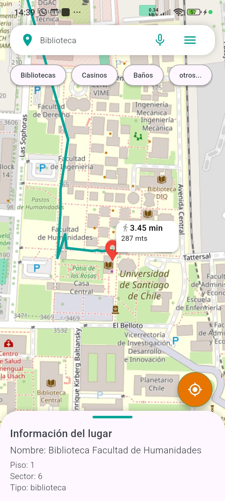
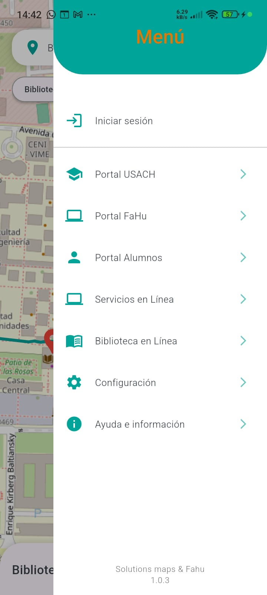
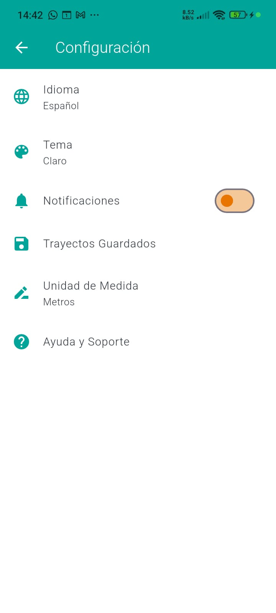

# Mapa FAHU - Fluttera

Aplicación de mapas desarrollada en Flutter para facilitar la orientación y navegación dentro del campus de la Universidad de Santiago de Chile (USACH), proporcionando un mapa interactivo accesos directos a portales institucionales y servicios clave para estudiantes, docentes y visitantes.

## Características principales
- Visualización de mapas interactivos del campus USACH
- Ayuda a estudiantes nuevos a encontrar salas, edificios, bibliotecas, casinos, etc.
- Ofrece enlaces rápidos a portales como el portal la biblioteca, Usach Atiende, etc.
- Guia a visitantes que no conocen el campus.
- Interfaz adaptativa a multiples plataformas.

## Capturas de pantalla

| Vista principal | Menu | servicios | config |
|-----------------|-----------------|-------------------|-------------------|
|  |  |  |  |

## Requisitos
- Flutter SDK 

## Instalación
1. Clona el repositorio:
   ```bash
   git clone https://github.com/cromx123/mapa_fahu.git
   ```
2. Navega al directorio del proyecto:
   ```bash
   cd mapa_fahu
   ```
3. Instala las dependencias:
   ```bash
   flutter pub get
   ```
4. Ejecuta la aplicación:
   ```bash
   flutter run
   ```

## Configuración

## Dependencias principales
- cupertino_icons: ^1.0.8
- flutter_vector_icons: ^2.0.0
- google_maps_flutter: ^2.2.3
- url_launcher: ^6.3.1

## Licencia
Este proyecto está bajo la licencia MIT - ver el archivo [LICENSE](LICENSE) para más detalles.
